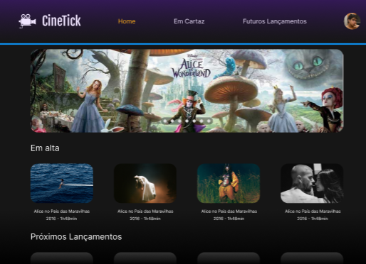

# Frame
Projeto de sistema para cinemas.

## cinetick
### Descrição 
Protótipo de Tela:

Cinetick é um site de cinema, que possui funcionalidade de registro e acesso para clientes e administradores. O sistema possui um catalogo abrangente de filmes em cartaz permitindo que os clientes escolhem e compre os ingressos. A plataforma também integra um sistema de pagamento online, garantido um sistema de compra pratica e segura.

### Requisitos Funcionais do Projeto

RF01 - Cadastro do Usuário

RF02 - Login do Usuário

RF03 - Catálogo de filmes

RF04 - Compra de ingressos

RF05 - Pagamento Online

### User Stories

**RF01 - Cadastro do Usuário** 
1. Como um cliente, quero poder criar uma conta no sistema para acessar o site, registrando minhas informações pessoais, como nome, e-mail. Para isso, na tela de login devo clicar em "Cadastre-se" logo abaixo do botão "Login". Ao clicar irá abrir o formulário de cadastro, no qual devo preencher todos os dados para concluir o cadastro.

prototipo de tela:

**RF02 - Login do Usuário**
1. Como um cliente cadastrado, quero poder acessar a plataforma utilizando meu e-mail e senha, para gerenciar minha conta e utilizar os serviços do Cinetick. Para isso, devo preencher os campos e-mail e senha com os dados cadastrados.

2. Como um cliente cadastrado, desejo recuperar minha senha caso a esqueça, para garantir que possa acessar minha conta novamente. Para isso, devo clicar em "Esqueci minha senha" logo abaixo de "Cadastre-se", que abrirá uma página para recuperação de senha.
 
Protótipo de Tela: 
(./prototipos/login.png)

**RF03 - Catálogo de filmes**
1. Como um cliente logado, quero poder visualizar o catálogo completo de filmes disponiveis no Cinetick, para que eu possa escolher o que desejo comprar. Para isso, na tela principal, devo ter acesso a uma lista organizada com descrições e imagens dos filmes. 

Protótipo de Tela:
(./prototipos/catalogo.png)

**RF04 - Compra de ingressos**
1. Como um cliente logado, quero poder comprar ingressos dos filmes escolhidos, para que eu possa revisar minhas escolhas antes de finalizar a compra. Para isso, devo clicar em "Comprar ingressos" abaixo do poster do filme selecionado. 
 
(./prototipos/catalogo.png)